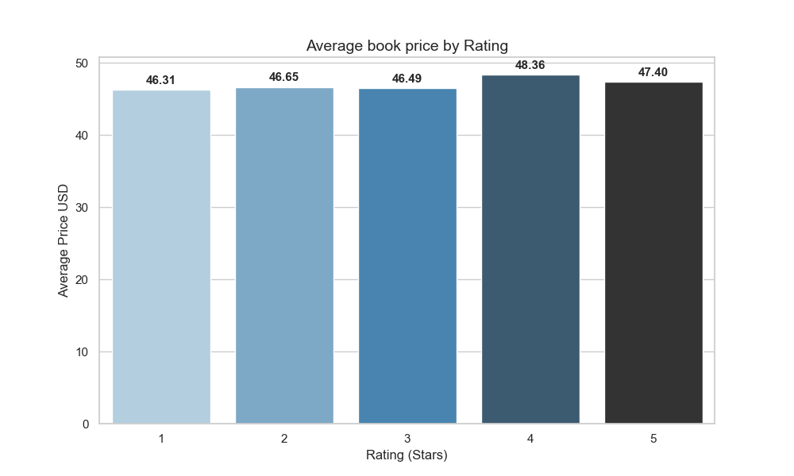
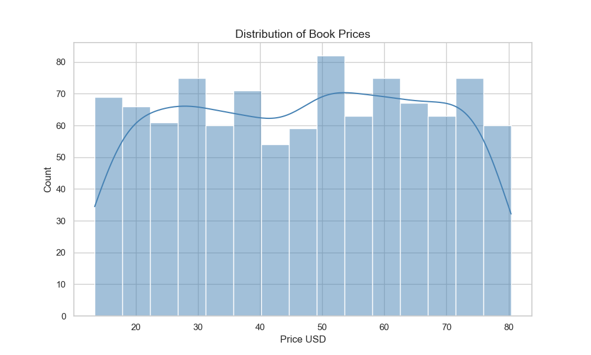
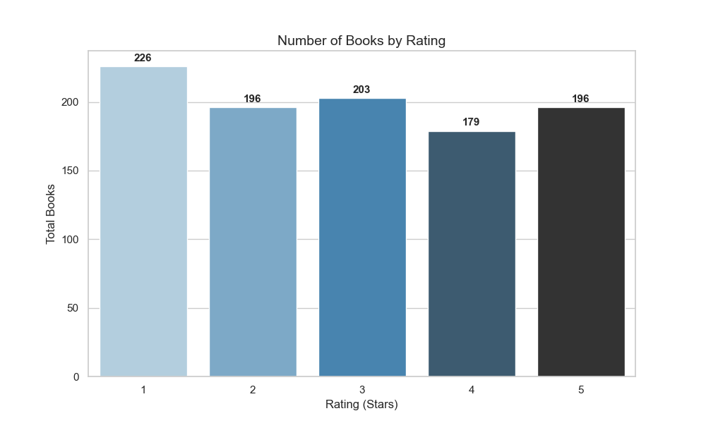
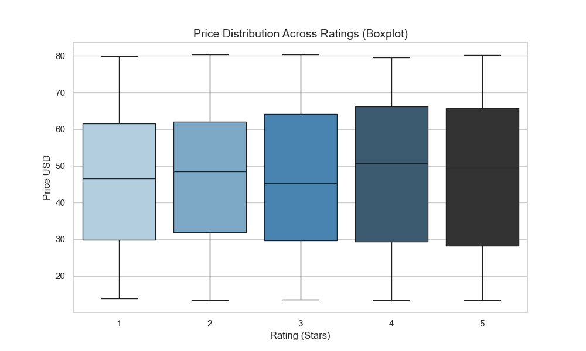
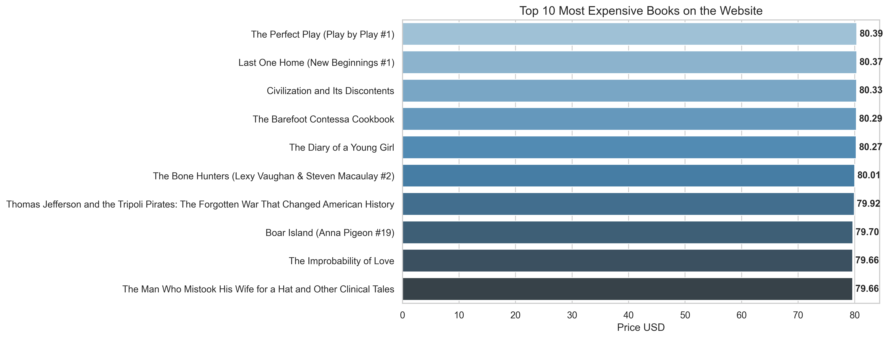

# Books Web Scraping & Analysis

Scraping and analysis of 1000 books from [books.toscrape.com](https://books.toscrape.com).

**Core question: does a book's rating influence its price?**

## Stack

- Python 3
- requests, BeautifulSoup4 — scraping
- pandas — cleaning and analysis
- matplotlib, seaborn — visualization

## Project Structure

```
Books/
├── 01_scraping.py        # Extract — scrapes 50 pages (~1000 books)
├── 02_cleaning.py        # Transform — cleans and transforms raw data
├── 03_analytics.py       # Analyze — statistics and key insights
├── 04_visualization.py   # builds all charts  
└── assets/
    ├── 01_price_by_rating.png
    ├── 02_price_distribution.png
    ├── 03_books_count_by_rating.png
    ├── 04_price_boxplot.png
    └── 05_top_10_expensive.png
```

## How to Run

```bash
# create and activate virtual environment
python -m venv .venv
source .venv/bin/activate      # macOS / Linux
.venv\Scripts\activate         # Windows

pip install -r requirements.txt

python 01_scraping.py
python 02_cleaning.py
python 03_analytics.py
python 04_visualization.py
```

## Methodology

The project follows an ETL pipeline:

- **Extract** — paginated scraping of 50 pages using requests and BeautifulSoup. Includes error handling with timeout and status code checks
- **Transform** — stripping currency symbols, casting types, converting GBP to USD (rate fixed as of May 2026), mapping text ratings to integers
- **Load** — saving results to CSV and charts to `assets/`

## Sample Visualizations







## Findings

- 1000 books scraped across 50 pages
- Average price: ~$46.99, range $13.40 — $80.39
- Rating has no noticeable effect on price — averages are nearly identical across all star ratings
- Prices are distributed roughly uniformly across the full range
